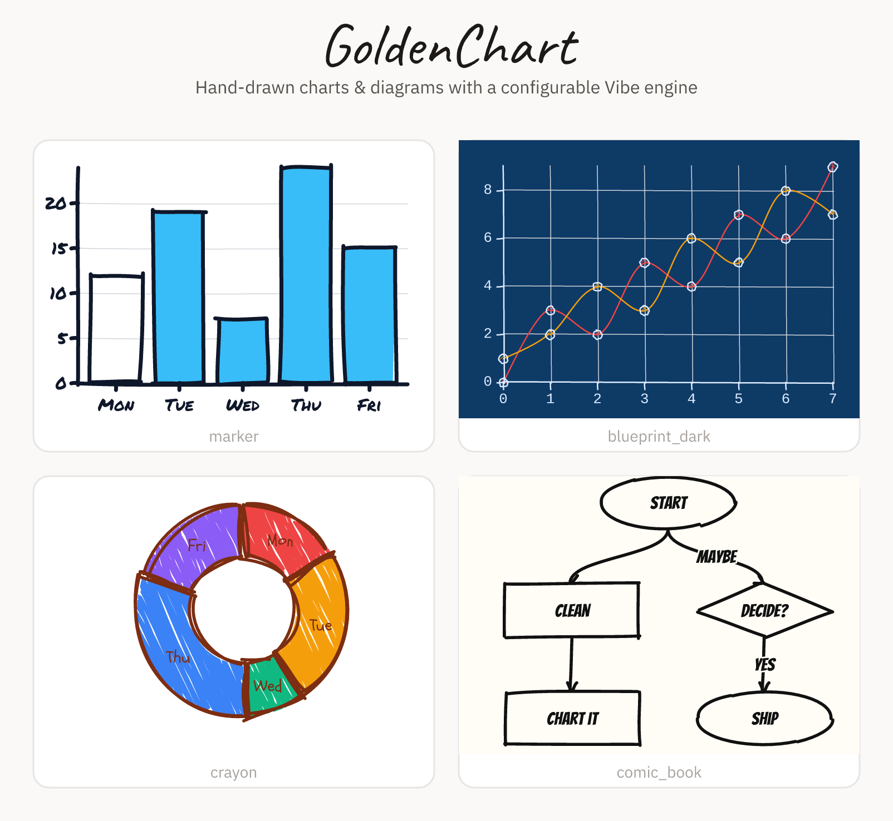
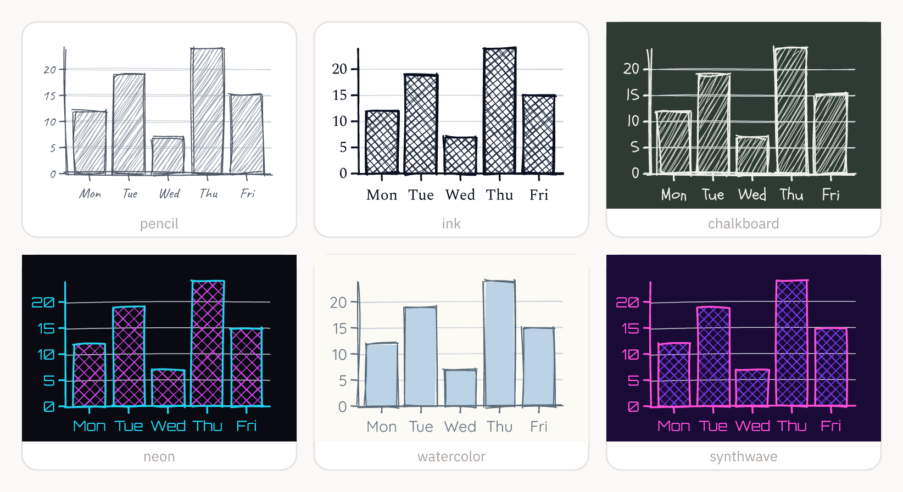
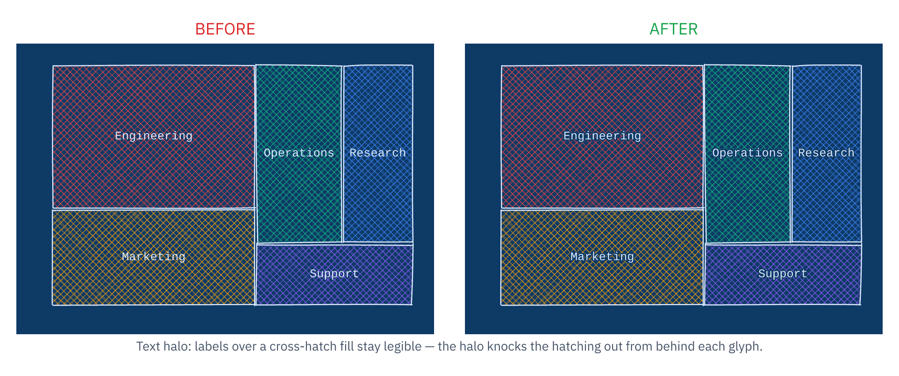
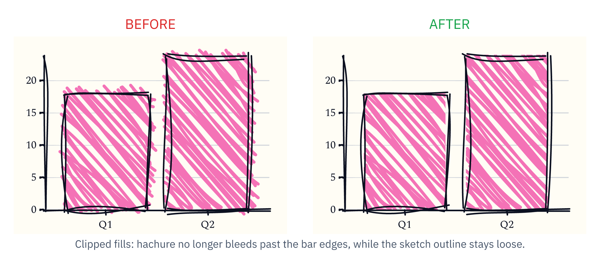

# GoldenChart

Hand-drawn, sketchy React charts and flowcharts.



**D3 does the math. Rough.js does the drawing. A Vibe engine dials in the aesthetic.**

GoldenChart cleanly separates *where* things go from *how* they look:

- **Calculation layer** (`d3-scale`, `d3-shape`, `d3-hierarchy`) computes coordinates,
  path strings, and layouts. It **never touches the DOM**.
- **Rendering layer** (`roughjs`) turns those coordinates into hand-drawn SVG paths.
- **The Vibe engine** translates a semantic string like `messy_sketch` into concrete
  Rough.js parameters (`roughness`, `bowing`, `hachureAngle`, `strokeWidth`, …).

## Install

```bash
npm install goldenchart roughjs d3-scale d3-shape d3-hierarchy
```

`react` / `react-dom` (v18+) are peer dependencies.

## Quick start

```tsx
import { BarChart } from 'goldenchart';

export function Sales() {
  return (
    <BarChart
      width={480}
      height={300}
      vibe="chaotic_notebook"
      data={[
        { label: 'Q1', value: 12 },
        { label: 'Q2', value: 19 },
        { label: 'Q3', value: 7 },
        { label: 'Q4', value: 24 },
      ]}
    />
  );
}
```

## Compose your own

Every chart is built from reusable primitives, so you can draw arbitrary diagrams.
Hand any D3-computed path string to `<RoughPath>`:

```tsx
import { Surface, RoughPath, RoughRectangle } from 'goldenchart';
import { linePath } from 'goldenchart';

<Surface width={400} height={200} vibe={{ preset: 'clean_blueprint', roughness: 1.2 }}>
  <RoughRectangle x={20} y={20} width={120} height={60} fill="#fde68a" />
  <RoughPath d={linePath([{ x: 0, y: 100 }, { x: 200, y: 40 }, { x: 400, y: 120 }], 'basis')} fill={null} />
</Surface>
```

## The Vibe engine

A `VibeConfig` is either a preset name or a preset plus targeted overrides:

```tsx
<BarChart vibe="messy_sketch" ... />
<BarChart vibe={{ preset: 'clean_blueprint', roughness: 2, stroke: '#0f766e' }} ... />
```

Built-in presets: `messy_sketch`, `clean_blueprint`, `chaotic_notebook`, `pencil`, `marker`,
`ink`, `crayon`, `davinci_journal`, `blueprint_dark`, `chalkboard`, `neon`, `comic_book`,
`terminal`, `watercolor`, `newsprint`, `whiteboard`, `typewriter`, `midnight`, `art_deco`, `manga`,
`highlighter`, `kraft`, `synthwave`, `botanical`, `risograph`, `sticky_note`, `amber_crt`. Add
`animate: { drawOn: true }` for a hand-drawn reveal (honors `prefers-reduced-motion`).

The same chart, six different vibes:



Each preset ships with a matching open-source font, subsetted and embedded as
`@font-face` in the SVG, so a vibe's typography renders identically in a browser
or a headless rasterizer with no installed/network fonts. Headless rasterizers
that load fonts explicitly (e.g. resvg) can use the exported `FONT_TTF_BASE64`.
See `src/assets/fonts/ATTRIBUTION.md` for sources and licences.

## Components

- **Charts:** `BarChart` (single/grouped/stacked), `LineChart`, `AreaChart` (+ stacked),
  `ScatterPlot`, `PieChart` (+ donut), `Flowchart`, `SankeyChart`, `TreemapChart`,
  `HeatmapChart`, `RadarChart`
- **Chart furniture:** `Axis`, `Grid`, `Legend`, `Annotations` (reference lines/bands, callouts)
- **Primitives:** `RoughPath`, `RoughLine`, `RoughRectangle`, `RoughCircle`, `RoughText`
- **Container:** `Surface` (Tailwind wrapper + `VibeProvider`)

`Flowchart` supports four layout directions (`TB`/`BT`/`LR`/`RL`), `rect`/`ellipse`/`diamond`
node shapes, edge labels, arrowheads, `curved`/`orthogonal` routing, and general DAG layout
(merges, multiple roots). Charts accept `description` / `ariaLabel` / `dataTable` for accessibility.

## Rendering quality

The sketchy look never gets in the way of reading the chart:

- **Legible labels** — text gets a page-colour halo (`paint-order: stroke`) so labels stay
  sharp on dark or textured vibes and even when they sit on top of a hachure fill.

  

- **Clean fills** — hachure is clipped to each shape, so the fill never bleeds past the edge
  while the sketch outline stays loose and hand-drawn.

  

- **Intentional reveal** — the optional `drawOn` animation sketches the outline first, then
  settles the fill in, instead of dashing the hatching. Open the
  [before](assets/quality-draw-on-before.svg) and [after](assets/quality-draw-on-after.svg)
  SVGs in a browser to compare.

## Architecture

```
src/
├── types/        # VibeConfig, base props, geometry, chart data shapes
├── vibe/         # presets + resolver (semantic string -> Rough.js options) + React context
├── core/         # D3 calculation layer — scales, shapes, ticks, arc, hierarchy, dag, sankey,
│                 #   treemap, polar, color scales, text metrics, stack, palette (no DOM)
├── render/       # shared Rough.js generator (DOM-free)
├── primitives/   # RoughPath / RoughLine / RoughRectangle / RoughCircle / RoughText
└── components/   # Surface, every chart, Axis, Grid, Legend, Annotations
```

## Playground

```bash
npm run playground        # interactive Vite demo of every chart + vibe
```

## MCP server

An MCP server in [`mcp/`](./mcp) exposes GoldenChart as tools at every level
(vibe, calculation, primitives, charts, orchestration/export), so an agent can
render charts and flowcharts as SVG. See [`mcp/README.md`](./mcp/README.md).

## Scripts

```bash
npm run build       # bundle with tsup (ESM + CJS + types)
npm run typecheck   # tsc --noEmit
npm test            # vitest
```

The README images live in [`assets/`](./assets) and are generated from the library itself —
rebuild them with `npm run build` then `cd mcp && npm run assets`.

## License

MIT
