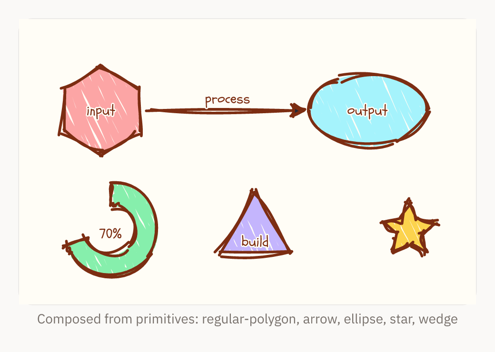

# GoldenChart

Hand-drawn, sketchy React charts and flowcharts.


**D3 does the math. Rough.js does the drawing. A Vibe engine dials in the aesthetic.**

**[Live demo →](https://benseverndev-oss.github.io/GoldenChart/)** · [npm](https://www.npmjs.com/package/goldenchart)

GoldenChart cleanly separates *where* things go from *how* they look:

- **Calculation layer** (`d3-scale`, `d3-shape`, `d3-hierarchy`) computes coordinates,
  path strings, and layouts. It **never touches the DOM**.
- **Rendering layer** (`roughjs`) turns those coordinates into hand-drawn SVG paths.
- **The Vibe engine** translates a semantic string like `messy_sketch` into concrete
  Rough.js parameters (`roughness`, `bowing`, `hachureAngle`, `strokeWidth`, …).

## Install

```bash
npm install goldenchart roughjs d3-scale d3-shape d3-hierarchy
```

`react` / `react-dom` (v18+) are peer dependencies.

## Quick start

```tsx
import { BarChart } from 'goldenchart';

export function Sales() {
  return (
    <BarChart
      width={480}
      height={300}
      vibe="chaotic_notebook"
      data={[
        { label: 'Q1', value: 12 },
        { label: 'Q2', value: 19 },
        { label: 'Q3', value: 7 },
        { label: 'Q4', value: 24 },
      ]}
    />
  );
}
```

## Compose your own

Every chart is built from reusable primitives, so you can draw arbitrary diagrams.
Hand any D3-computed path string to `<RoughPath>`:

```tsx
import { Surface, RoughPath, RoughRectangle } from 'goldenchart';
import { linePath } from 'goldenchart';

<Surface width={400} height={200} vibe={{ preset: 'clean_blueprint', roughness: 1.2 }}>
  <RoughRectangle x={20} y={20} width={120} height={60} fill="#fde68a" />
  <RoughPath d={linePath([{ x: 0, y: 100 }, { x: 200, y: 40 }, { x: 400, y: 120 }], 'basis')} fill={null} />
</Surface>
```

Beyond lines and rectangles, the calculation layer ships path builders for richer
shapes — `regularPolygonPath`, `starPath`, `arcStrokePath`, `wedgePath`,
`ellipsePath` — plus `connectorPath` for arrows (shaft + arrowhead + label, with
straight/curved/orthogonal routing). Hand any of their path strings to `<RoughPath>`.
The MCP server exposes the same shapes as `compose_surface` scene kinds
(`polygon`, `regular-polygon`, `star`, `arc`, `wedge`, `ellipse`, `arrowhead`, `arrow`).



## The Vibe engine

A `VibeConfig` is either a preset name or a preset plus targeted overrides:

```tsx
<BarChart vibe="messy_sketch" ... />
<BarChart vibe={{ preset: 'clean_blueprint', roughness: 2, stroke: '#0f766e' }} ... />
```

Built-in presets: `messy_sketch`, `clean_blueprint`, `chaotic_notebook`, `pencil`, `marker`,
`ink`, `crayon`, `davinci_journal`, `blueprint_dark`, `chalkboard`, `neon`, `comic_book`,
`terminal`, `watercolor`, `newsprint`, `whiteboard`, `typewriter`, `midnight`, `art_deco`, `manga`,
`highlighter`, `kraft`, `synthwave`, `botanical`, `risograph`, `sticky_note`, `amber_crt`. Add
`animate: { drawOn: true }` for a hand-drawn reveal (honors `prefers-reduced-motion`).

Matte vibes can carry a faint paper-grain speckle behind the data via
`texture: 'paper' | 'paper-subtle' | 'none'` (several paper-like presets enable
`'paper'` by default). See [`docs/API.md#vibe-engine`](./docs/API.md#vibe-engine).

The same chart, six different vibes:


Each preset ships with a matching open-source font. Rendering is environment-aware:

- **Headless/server rendering** (`goldenchart/server`, the MCP server, PNG export) embeds the
  vibe's font automatically as `@font-face` in the SVG, so that output is self-contained and
  renders identically with no installed/network fonts.
- **Browser rendering** emits the `font-family` and relies on the page's webfonts, keeping the
  main bundle small (~35 KB gzipped). To make a browser-rendered SVG self-contained, import from
  `goldenchart/fonts` and inject the CSS:

  ```tsx
  import { fontFaceFor } from 'goldenchart/fonts';
  // inject fontFaceFor('pencil') into a <style> in your document for self-contained output
  ```

Rasterizers that load fonts explicitly (e.g. resvg) can use `FONT_TTF_BASE64` from
`goldenchart/fonts`. See `src/assets/fonts/ATTRIBUTION.md` for sources and licences.

## Branding

Layer a `brand` on top of any vibe to recolour a chart to your own identity while
keeping the hand-drawn feel. The vibe controls *how* a chart is drawn; the brand
sets *identity* — `palette`, `primary` / `ink` / `page` colours, `font`, and a
corner `logo`. Every field is optional, and an explicit `vibe` override still wins
over the brand.

```tsx
<BarChart
  vibe="pencil"
  brand={{
    palette: ['#ff6b35', '#f7b801', '#7a9e7e', '#ef476f', '#118ab2'],
    primary: '#ff6b35',
    ink: '#3a2317',
    page: '#fff8ef',
    logo: { src: logoUrl, position: 'bottom-right', width: 88 },
  }}
  data={data}
/>;
```

Full field reference and precedence rules: [`docs/API.md#branding`](./docs/API.md#branding).

## Components

- **Charts:** `BarChart` (single/grouped/stacked), `LineChart`, `AreaChart` (+ stacked),
  `ScatterPlot`, `PieChart` (+ donut), `SankeyChart`, `TreemapChart`,
  `HeatmapChart`, `RadarChart`
- **Diagrams:** `Flowchart`, `MindMap`, `OrgChart`, `ArchitectureDiagram`,
  `SequenceDiagram`, `ERDiagram`, `Timeline`, plus the low-level `Diagram`
- **Auto-charting:** `AutoChart` / `visualize` (pick a chart from the data)
- **Chart furniture:** `Axis`, `Grid`, `Legend`, `Annotations` (reference lines/bands, callouts)
- **Primitives:** `RoughPath`, `RoughLine`, `RoughRectangle`, `RoughCircle`, `RoughText`
- **Container:** `Surface` (Tailwind wrapper + `VibeProvider`)

Every chart and diagram shares a `BaseChartProps` base (`width`, `height`, `vibe`,
`margin`, `title`, `description`, `ariaLabel`, `bare`). Data charts also accept
`dataTable` to emit a visually-hidden table for screen readers; diagrams render a
`role="img"` surface with `title`/`description`.

See [`docs/API.md`](./docs/API.md) for the full per-component prop reference.

## Auto-charting

Hand `visualize` (or its component form `AutoChart`) a row-oriented dataset and it
profiles the fields, picks a chart, and renders it. Steer it with an `intent`
(`trend`, `compare`, `composition`, `distribution`, `correlation`, `flow`, `hierarchy`):

```tsx
import { AutoChart } from 'goldenchart';

<AutoChart
  width={480}
  height={300}
  intent="trend"
  data={[
    { month: 'Jan', revenue: 12 },
    { month: 'Feb', revenue: 19 },
    { month: 'Mar', revenue: 7 },
  ]}
/>;
```

Or just describe what you want — `visualize` / `AutoChart` also accept a
plain-English `query` that picks the chart type, maps fields to roles, and selects
a vibe from the sentence. Any explicit prop you pass still wins.

```tsx
import { visualize } from 'goldenchart';

// "revenue by month as a line in pencil"
visualize(data, { query: 'revenue by month as a line in pencil', width: 480, height: 300 });
```

See the [natural-language query reference](./docs/API.md#natural-language-queries)
for the full grammar (chart types, intents, field roles, vibes).

## Diagrams

Beyond charts, GoldenChart lays out and sketches node-link diagrams. `Flowchart`,
`MindMap`, `OrgChart`, and `ArchitectureDiagram` take `nodes` / `edges` and a layout
engine; `SequenceDiagram` (`actors` / `messages`), `ERDiagram` (`entities` /
`relationships`), and `Timeline` (`events`) are purpose-built.

```tsx
import { Flowchart } from 'goldenchart';

<Flowchart
  width={420}
  height={260}
  direction="TB"
  nodes={[
    { id: 'a', label: 'Start' },
    { id: 'b', label: 'Work', shape: 'diamond' },
    { id: 'c', label: 'Done' },
  ]}
  edges={[
    { from: 'a', to: 'b' },
    { from: 'b', to: 'c', label: 'ok' },
  ]}
/>;
```

`Flowchart` supports four layout directions (`TB`/`BT`/`LR`/`RL`), `rect`/`ellipse`/`diamond`
node shapes, edge labels, arrowheads, `curved`/`orthogonal` routing, and general DAG layout
(merges, multiple roots).

You can also parse [Mermaid](https://mermaid.js.org/) source into a diagram spec with
`parseMermaid` (flowchart, sequence, and mindmap syntaxes) and render it with `renderDiagram`:

```tsx
import { parseMermaid, renderDiagram } from 'goldenchart';

const spec = parseMermaid('graph TD; A-->B; B-->C;');
renderDiagram(spec, { width: 400, height: 240, vibe: 'pencil' });
```

## Interactivity (opt-in)

Interactivity is a progressive enhancement behind the `goldenchart/interactive`
subpath — the static `goldenchart` entry stays untouched and font-free. Wrap any
chart in `<InteractiveChart>` for sketched, vibe-matched tooltips, hover/selection,
an interactive legend, semantic zoom/pan, brushing, animated data transitions, and
linked crossfilter:

```tsx
import { BarChart } from 'goldenchart';
import { InteractiveChart } from 'goldenchart/interactive';

<InteractiveChart tooltip selectable>
  <BarChart width={480} height={300} vibe="pencil" data={data} />
</InteractiveChart>;
```

Charts emit an inert `data-gc-*` mark contract that the client layer reads, so the
server/MCP SVG is identical with or without it. `interactiveEmbed(svg)` (and the
MCP `export_interactive_html` tool) wrap a static SVG into a self-contained
hover-interactive HTML file. See [`docs/INTERACTIVITY.md`](./docs/INTERACTIVITY.md).

## Rendering quality

The sketchy look never gets in the way of reading the chart:

- **Legible labels** — text gets a page-colour halo (`paint-order: stroke`) so labels stay
  sharp on dark or textured vibes and even when they sit on top of a hachure fill.

  

- **Clean fills** — hachure is clipped to each shape, so the fill never bleeds past the edge
  while the sketch outline stays loose and hand-drawn.

  

- **Intentional reveal** — the optional `drawOn` animation sketches the outline first, then
  settles the fill in, instead of dashing the hatching. Open the
  [before](assets/quality-draw-on-before.svg) and [after](assets/quality-draw-on-after.svg)
  SVGs in a browser to compare.

## Architecture

```
src/
├── types/        # VibeConfig, base props, geometry, chart data shapes
├── vibe/         # presets + resolver (semantic string -> Rough.js options) + React context
├── core/         # D3 calculation layer — scales, shapes, ticks, arc, hierarchy, dag, sankey,
│                 #   treemap, polar, color scales, text metrics, stack, palette (no DOM)
├── render/       # shared Rough.js generator (DOM-free)
├── primitives/   # RoughPath / RoughLine / RoughRectangle / RoughCircle / RoughText
└── components/   # Surface, every chart, Axis, Grid, Legend, Annotations
```

## Playground

```bash
npm run playground        # interactive Vite demo of every chart + vibe
```

## MCP server

An MCP server in [`mcp/`](./mcp) exposes GoldenChart as tools at every level
(vibe, calculation, primitives, charts, orchestration/export), so an agent can
render charts and flowcharts as SVG. See [`mcp/README.md`](./mcp/README.md).

## Scripts

```bash
npm run build       # bundle with tsup (ESM + CJS + types)
npm run typecheck   # tsc --noEmit
npm test            # vitest
```

The README images live in [`assets/`](./assets) and are generated from the library itself —
rebuild them with `npm run build` then `cd mcp && npm run assets`.

## License

MIT
