# GoldenChart

Hand-drawn, sketchy React charts and flowcharts.

**D3 does the math. Rough.js does the drawing. A Vibe engine dials in the aesthetic.**

GoldenChart cleanly separates *where* things go from *how* they look:

- **Calculation layer** (`d3-scale`, `d3-shape`, `d3-hierarchy`) computes coordinates,
  path strings, and layouts. It **never touches the DOM**.
- **Rendering layer** (`roughjs`) turns those coordinates into hand-drawn SVG paths.
- **The Vibe engine** translates a semantic string like `messy_sketch` into concrete
  Rough.js parameters (`roughness`, `bowing`, `hachureAngle`, `strokeWidth`, …).

## Install

```bash
npm install goldenchart roughjs d3-scale d3-shape d3-hierarchy
```

`react` / `react-dom` (v18+) are peer dependencies.

## Quick start

```tsx
import { BarChart } from 'goldenchart';

export function Sales() {
  return (
    <BarChart
      width={480}
      height={300}
      vibe="chaotic_notebook"
      data={[
        { label: 'Q1', value: 12 },
        { label: 'Q2', value: 19 },
        { label: 'Q3', value: 7 },
        { label: 'Q4', value: 24 },
      ]}
    />
  );
}
```

## Gallery

Every image below is rendered headlessly to SVG/PNG by the library itself (see
[`mcp/scripts/generate-gallery.ts`](./mcp/scripts/generate-gallery.ts)) — no browser, no canvas.

### Charts

<table>
<tr>
<td align="center"><br><sub>Bar</sub></td>
<td align="center">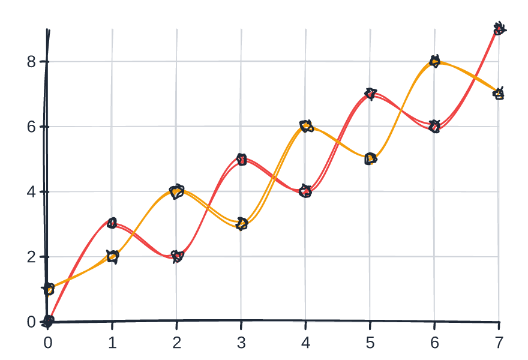<br><sub>Line</sub></td>
<td align="center">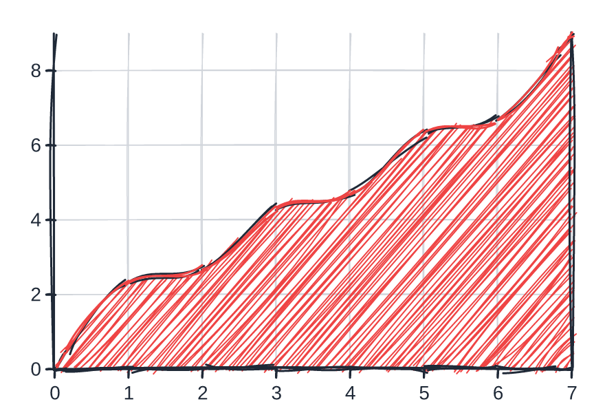<br><sub>Area</sub></td>
</tr>
<tr>
<td align="center">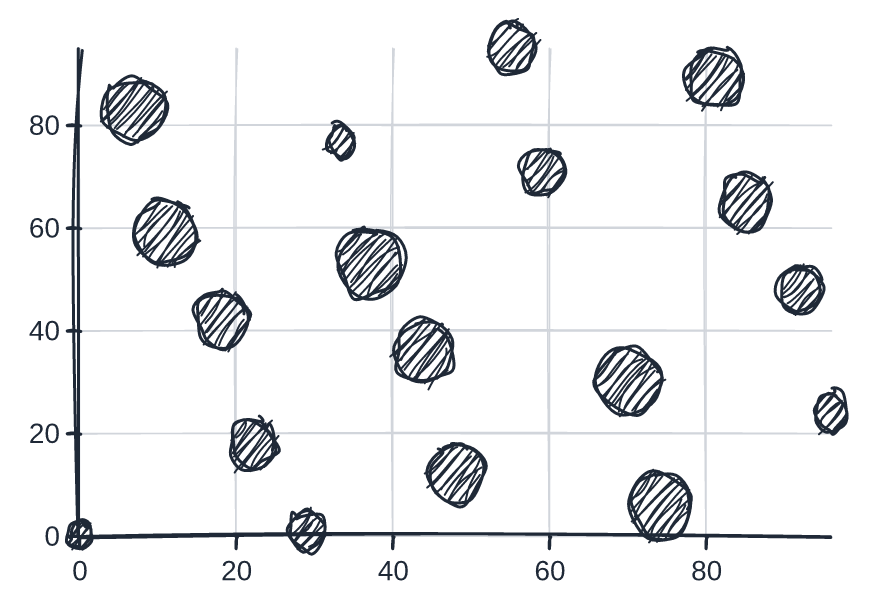<br><sub>Scatter</sub></td>
<td align="center">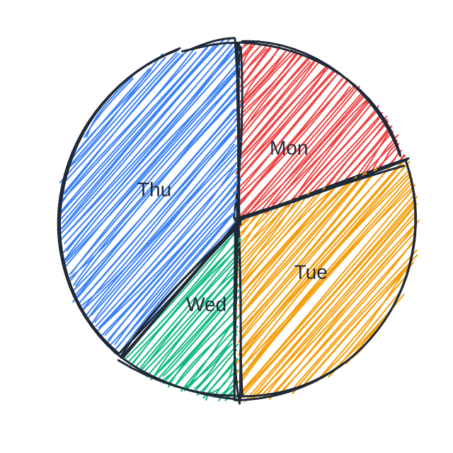<br><sub>Pie / donut</sub></td>
<td align="center">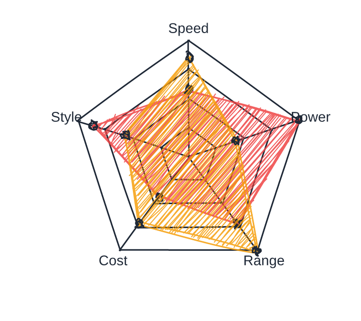<br><sub>Radar</sub></td>
</tr>
<tr>
<td align="center">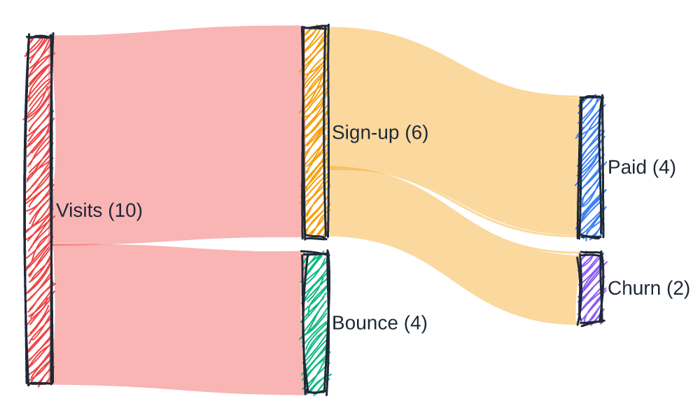<br><sub>Sankey</sub></td>
<td align="center">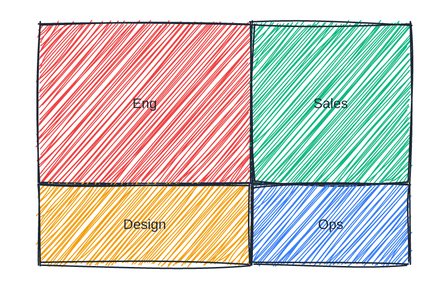<br><sub>Treemap</sub></td>
<td align="center">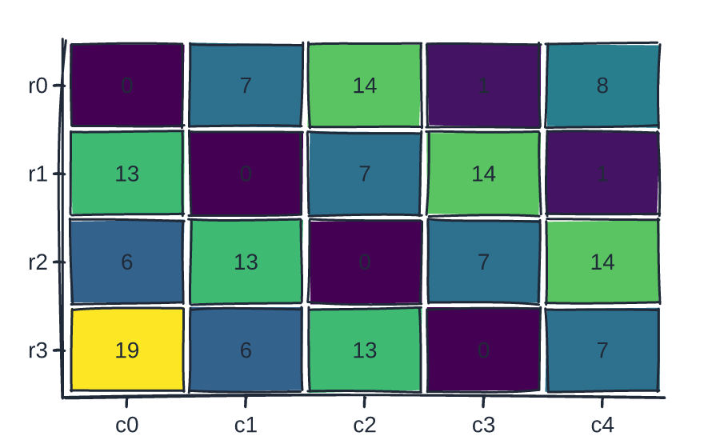<br><sub>Heatmap</sub></td>
</tr>
</table>

### Diagrams

<table>
<tr>
<td align="center">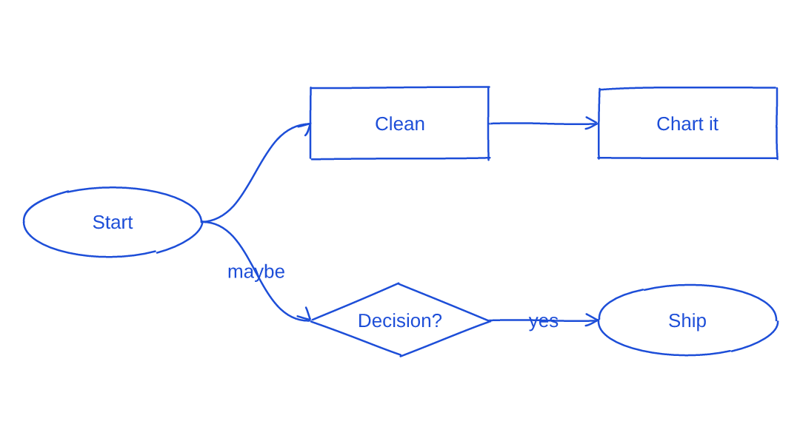<br><sub>Flowchart</sub></td>
<td align="center">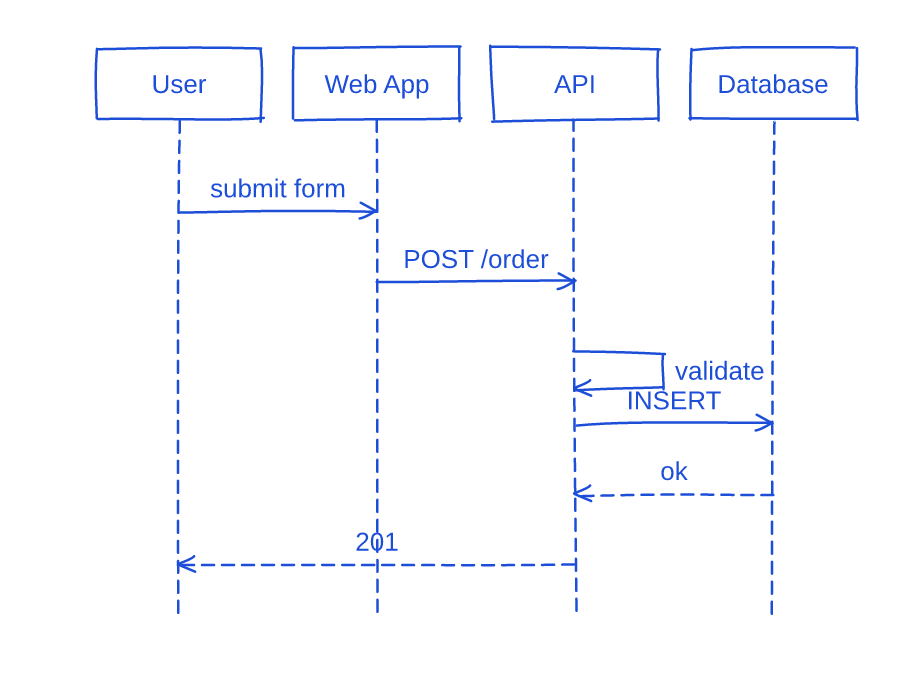<br><sub>Sequence</sub></td>
<td align="center">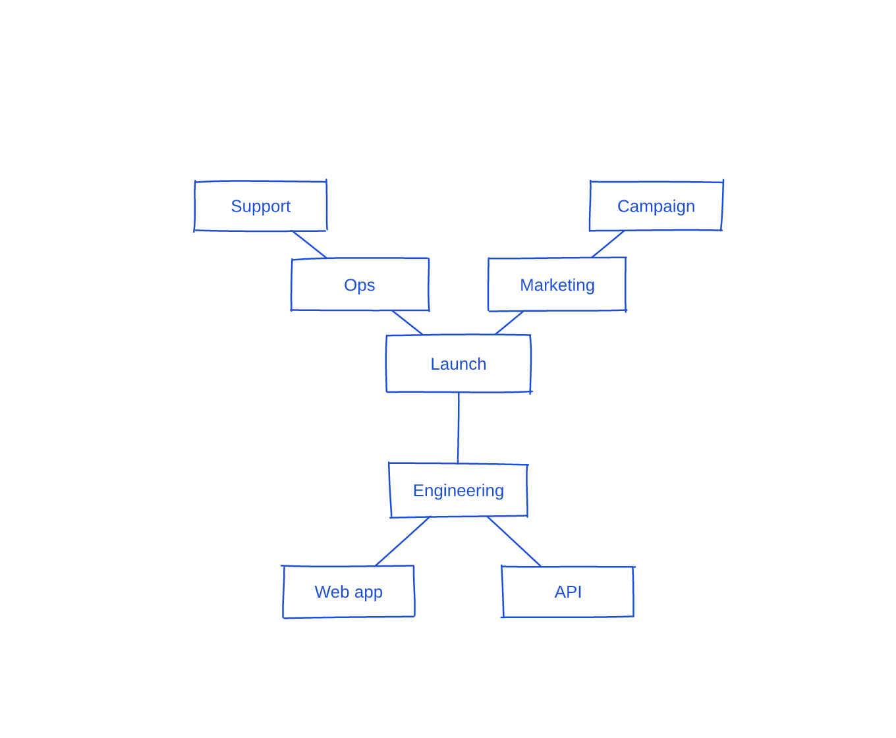<br><sub>Mind map</sub></td>
</tr>
<tr>
<td align="center">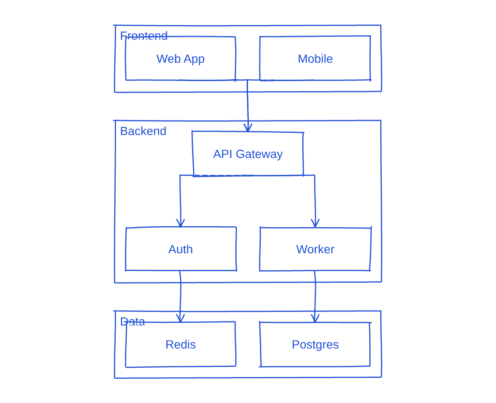<br><sub>Architecture</sub></td>
<td align="center">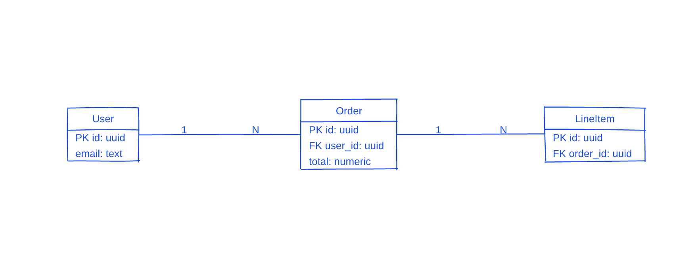<br><sub>ER</sub></td>
<td align="center">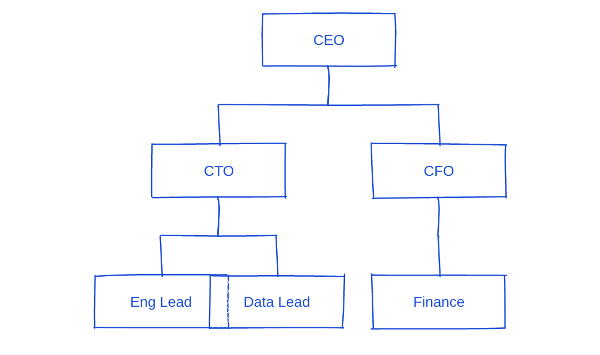<br><sub>Org chart</sub></td>
</tr>
<tr>
<td align="center">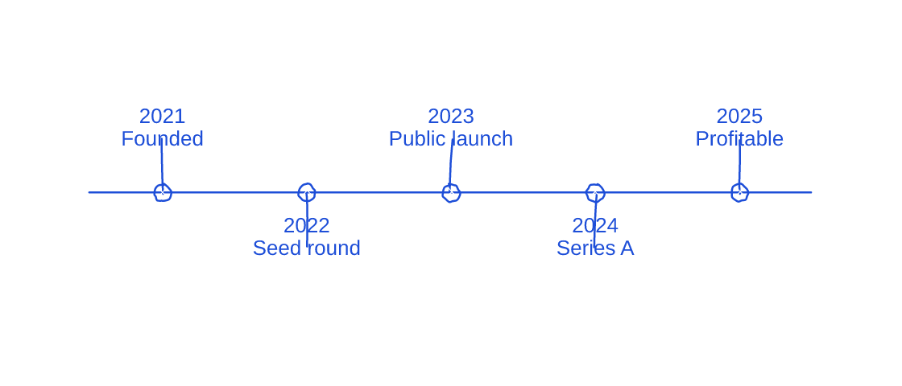<br><sub>Timeline</sub></td>
<td align="center">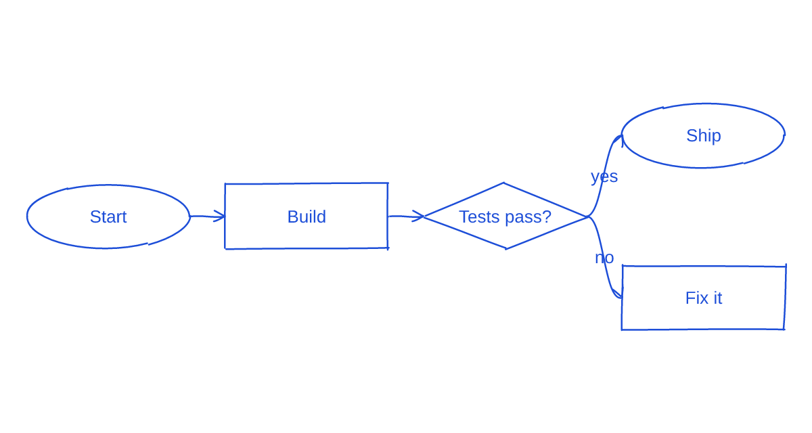<br><sub>From Mermaid</sub></td>
<td></td>
</tr>
</table>

### One chart, three vibes

<table>
<tr>
<td align="center">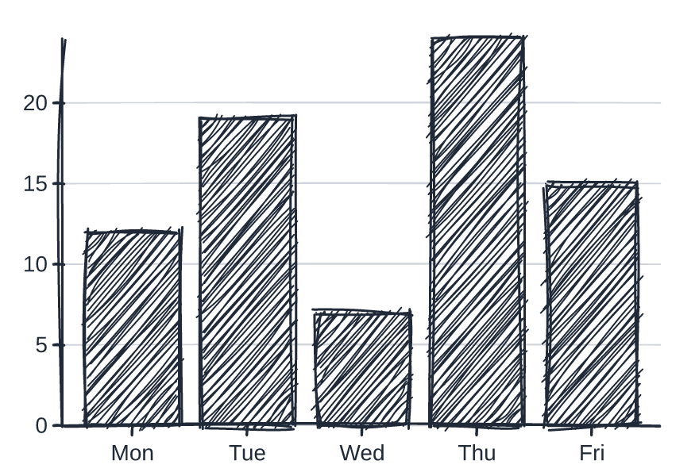<br><sub><code>messy_sketch</code></sub></td>
<td align="center">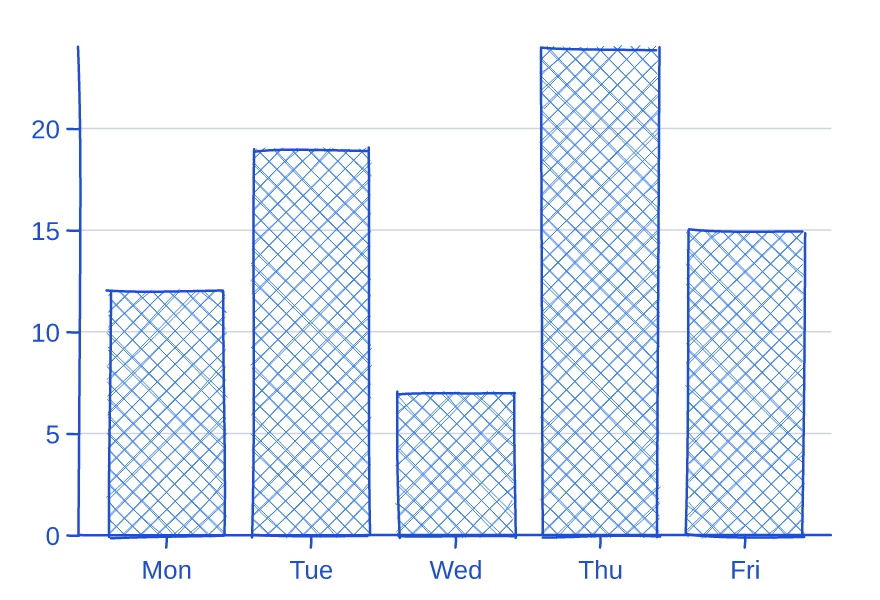<br><sub><code>clean_blueprint</code></sub></td>
<td align="center">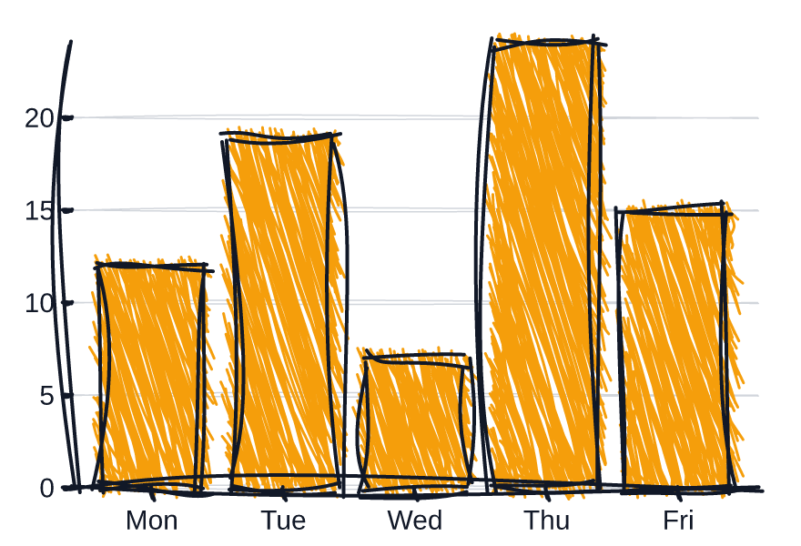<br><sub><code>chaotic_notebook</code></sub></td>
</tr>
</table>

Crisp SVG versions of every image live alongside the PNGs in [`assets/gallery/`](./assets/gallery).

## Compose your own

Every chart is built from reusable primitives, so you can draw arbitrary diagrams.
Hand any D3-computed path string to `<RoughPath>`:

```tsx
import { Surface, RoughPath, RoughRectangle } from 'goldenchart';
import { linePath } from 'goldenchart';

<Surface width={400} height={200} vibe={{ preset: 'clean_blueprint', roughness: 1.2 }}>
  <RoughRectangle x={20} y={20} width={120} height={60} fill="#fde68a" />
  <RoughPath d={linePath([{ x: 0, y: 100 }, { x: 200, y: 40 }, { x: 400, y: 120 }], 'basis')} fill={null} />
</Surface>
```

## The Vibe engine

A `VibeConfig` is either a preset name or a preset plus targeted overrides:

```tsx
<BarChart vibe="messy_sketch" ... />
<BarChart vibe={{ preset: 'clean_blueprint', roughness: 2, stroke: '#0f766e' }} ... />
```

Built-in presets: `messy_sketch`, `clean_blueprint`, `chaotic_notebook`, `pencil`, `marker`,
`ink`, `crayon`. Add `animate: { drawOn: true }` for a hand-drawn reveal (honors
`prefers-reduced-motion`).

## Components

- **Charts:** `BarChart` (single/grouped/stacked), `LineChart`, `AreaChart` (+ stacked),
  `ScatterPlot`, `PieChart` (+ donut), `SankeyChart`, `TreemapChart`, `HeatmapChart`, `RadarChart`
- **Diagrams:** `Flowchart`, `SequenceDiagram`, `MindMap`, `ArchitectureDiagram`, `ERDiagram`,
  `Timeline`, `OrgChart` — all on a shared `Diagram` model + pluggable `LayoutEngine`
- **Chart furniture:** `Axis`, `Grid`, `Legend`, `Annotations` (reference lines/bands, callouts)
- **Primitives:** `RoughPath`, `RoughLine`, `RoughRectangle`, `RoughCircle`, `RoughText`
- **Container:** `Surface` (Tailwind wrapper + `VibeProvider`)

`Flowchart` supports four layout directions (`TB`/`BT`/`LR`/`RL`), `rect`/`ellipse`/`diamond`
node shapes, edge labels, arrowheads, `curved`/`orthogonal` routing, and general DAG layout
(merges, multiple roots). The architecture diagram adds zone containers and a hand-rolled
orthogonal obstacle router. Charts accept `description` / `ariaLabel` / `dataTable` for accessibility.

## Auto-visualization & diagram DSL

- **`visualize(data)` / `<AutoChart>`** profile raw records, pick the best-fit chart, and render it —
  zero manual prop wiring. `critiqueChart` flags common dataviz mistakes (too many categories,
  label collisions, misleading pies, …) for an agentic refine loop.
- **`renderDiagram(spec)`** dispatches a high-level `{ kind, … }` spec to any diagram type, and
  **`parseMermaid(source)`** turns a Mermaid subset (`flowchart`, `sequenceDiagram`, `mindmap`) into
  that spec — "hand-drawn Mermaid".

## Architecture

```
src/
├── types/        # VibeConfig, base props, geometry, chart data shapes
├── vibe/         # presets + resolver (semantic string -> Rough.js options) + React context
├── core/         # D3 calculation layer — scales, shapes, ticks, arc, hierarchy, dag, sankey,
│                 #   treemap, polar, color scales, text metrics, stack, palette (no DOM)
├── render/       # shared Rough.js generator (DOM-free)
├── primitives/   # RoughPath / RoughLine / RoughRectangle / RoughCircle / RoughText
└── components/   # Surface, every chart, Axis, Grid, Legend, Annotations
```

## Playground

```bash
npm run playground        # interactive Vite demo of every chart + vibe
```

## MCP server

An MCP server in [`mcp/`](./mcp) exposes GoldenChart as tools at every level
(vibe, calculation, primitives, charts, orchestration/export), so an agent can
render charts and flowcharts as SVG. See [`mcp/README.md`](./mcp/README.md).

## Scripts

```bash
npm run build       # bundle with tsup (ESM + CJS + types)
npm run typecheck   # tsc --noEmit
npm test            # vitest
```

## License

MIT
